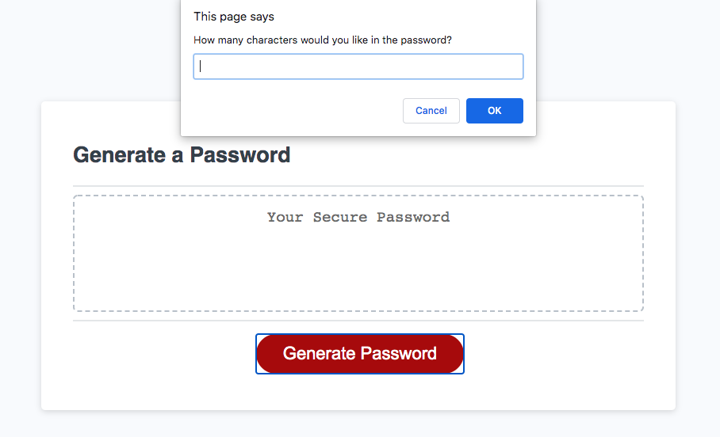

# Random-Password-Generator

## Table of Contents:
1. Purpose
2. Requirements
3. Screenshot
4. Link to Webpage:
5. License & Copyright

## Purpose
Creates a random password based on user input and chanracter type selections.

## Requirements

_GIVEN I need a new, secure password_
_WHEN I click the button to generate a password_
_THEN I am presented with a series of prompts for password criteria_
_WHEN prompted for password criteria_
_THEN I select which criteria to include in the password_
_WHEN prompted for the length of the password_
_THEN I choose a length of at least 8 characters and no more than 128 characters_
_WHEN prompted for character types to include in the password_
_THEN I choose lowercase, uppercase, numeric, and/or special characters_
_WHEN I answer each prompt_
_THEN my input should be validated and at least one character type should be selected_
_WHEN all prompts are answered_
_THEN a password is generated that matches the selected criteria_
_WHEN the password is generated_
_THEN the password is either displayed in an alert or written to the page_

## Screenshot

## Link to deployed webpage

[Click to view Live Website](https://rajendra-dhanraj.github.io/Random-Password-Generator/ "Random Password Generator")

## License

MIT 